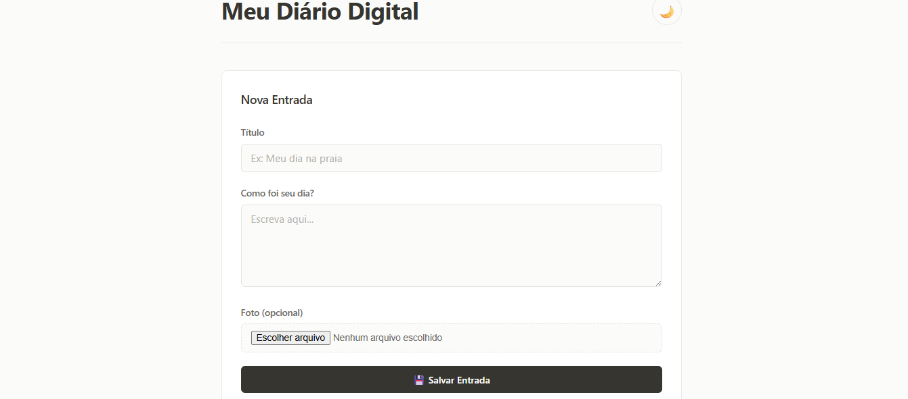
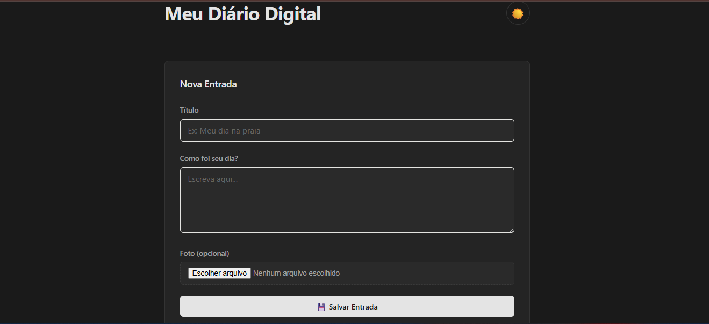
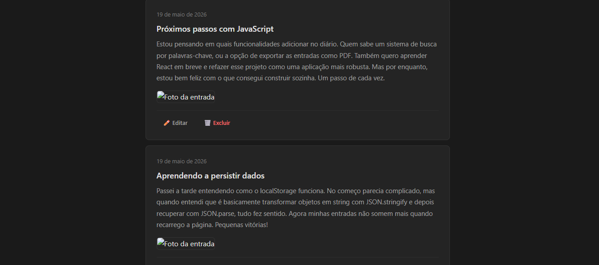

# 📔 Diário Digital

Um diário pessoal digital construído com **HTML, CSS e JavaScript puro**, como projeto de portfólio após a conclusão do curso de JavaScript pela UC Davis.

---

## 📸 Preview

<div align="center">
  
  
  
</div>

---

## Funcionalidades:

- **Criar** entradas com título, texto e foto
- **Ler** todas as entradas em cards organizados por data
- **Atualizar** qualquer entrada existente
- **Deletar** entradas
- **Upload de fotos** com preview antes de salvar
- **Persistência de dados** usando `localStorage`
- **Tema escuro/claro** com preferência salva
- **Design responsivo** (funciona no celular e desktop)
- **Validação visual** dos campos obrigatórios

---

## 🛠️ Tecnologias Utilizadas:

| Tecnologia | Uso |
|---|---|
| HTML5 | Estrutura semântica |
| CSS3 | Estilização com variáveis, flexbox e transições |
| JavaScript ES6+ | Lógica, manipulação do DOM, eventos |
| LocalStorage API | Persistência de dados no navegador |
| FileReader API | Leitura e preview de imagens |
| Git & GitHub | Versionamento de código |

---

## O que aprendi com este projeto?

- Manipulação do DOM com JavaScript puro
- CRUD completo (Create, Read, Update, Delete)
- Trabalhar com `localStorage` para persistir dados
- Converter imagens para base64 com `FileReader`
- Implementar tema escuro com variáveis CSS
- Organizar código com funções reutilizáveis
- Versionamento com Git e GitHub

---

## Como rodar localmente:

```bash
# Clone o repositório
git clone https://github.com/alananjos06/diario-digital.git

# Entre na pasta
cd diario-digital

# Abra o arquivo index.html no navegador
# Ou use uma extensão como Live Server no VS Code
```

## 👩‍💻 Autora
Feito por Alana Anjos.